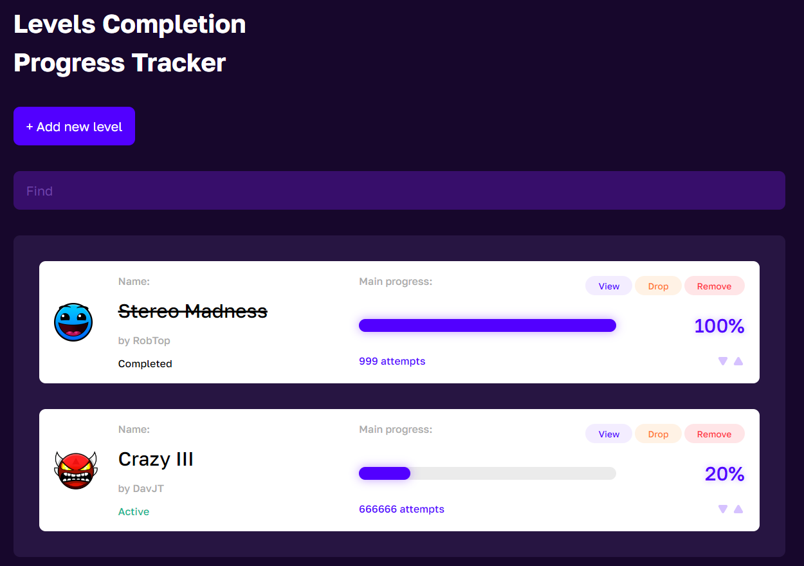

# LevelsCompletionTracker

**Levels completion tracker** is a small application that help you save your progresses and tracking your completion.

## Features

1. Creating, deleting and changing the state of levels
2. View and setting the main progress of current levels
3. View and setting the further progresses of levels (include the date of creating the progress)
4. View and setting attempts
5. Manage the level list
6. (NEW!) View and setting the circle runs progresses

## Preview

## Requirements

### For executing: 
- .NET 7
- Browser

## For development:
- .NET 7
- Node.js
